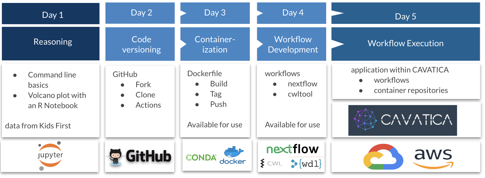

## 👉 [MARCH 13-MARCH 17, 2023 CLICK TO REGISTER](https://app.smartsheet.com/b/publish?EQBCT=f3810ff59f864c45a4d88ed8b0d08a1f) 👈 

|      |        |
| ------------- | --------------------------------------------------------------------------- |
|  |  |

##  Kids First & INCLUDE Elements of Style in Workflow Creation 

Gabriella Miller Kids First Pediatric Research Program (Kids First) and the INCLUDE (INvestigation of Co-occuring Conditions Across the Lifespan to Understand Down syndromE) Project are joining forces to offer a 5-day training program designed specifically for researchers.  Learn how to use cloud platforms and workflows to ask scientific questions with ease and confidence.   Our expert instructors will guide you through the processes that assure reproducibility, repurposability regardless of the computational environment.  Achieve greater success with a modular, testable approach to work.

In 2018, the [NIH](https://www.nih.gov/) launched [INCLUDE Project](https://www.nih.gov/include-project) to improve the health and quality of life for people with Down syndrome.  The INCLUDE Data Coordinating Center (DCC) was created to give Down Syndrome researchers and the community access to data and analysis tools including a free-to-use resource called the [INCLUDE Data Hub](https://portal.includedcc.org/login?redirect_path=/dashboard).   The Data Hub brings information and resources from many sources to gether in one place and allows scientists to study conditions affecting individuals with Down syndrome fastr than ever before.

Kids First is a trans-NIH Common Fund program whose goal is to help researchers uncover new insights into the biology of childhood cancer and structural birth defects, including the discovery of shared genetic pathways between these disorders.   To achieve this goal, the program has developed the Kids First Data Resource Center, a cloud-based platform which publicly shares genetic and clinical data from 30,000 childhood cancer and structural birth defect patients and families.   Through the [Kids First Data Resource Portal](https://portal.kidsfirstdrc.org/login) researchers have access to analysis tools and collaborative research.

**Both of these platforms are gateways that provide democratizing access to the vast and flexible world of cloud computing, powered by CAVATICA and Seven Bridges**

**Before you attend the course, you need to set up [GitHub](https://github.com/), [Zenodo](https://zenodo.org/) and [ORCID](https://orcid.org/register) accounts and have basic knowledge of the terminal window, shell environment and the commands for navigation within that environment**

## Course Overview:

                                                       
